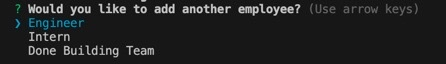

# Team-Profile-Generator

## Description

I created a command line application using node.js that allows the user to generate a team profile. This application allows the user to create profile's of different types of employees -- a Manager, Engineer, and Intern -- through a prompt of questions.

## License:  

## Table of Contents
1. [Description](#description)
2. [Installation](#installation)
3. [Usage](#usage)
4. [Credits](#credits)
5. [Contributing](#contributing)
6. [License](#license)
7. [Questions](#questions)
8. [Tests](#tests)

## Installation

In order for this application to work you will need the node environment installed on your computer. Adequate instructions for downloading the environment can be found at nodejs.org. The inquirer package is used in this application to prompt questions, and the jest package is used to run tests. To install inquirer and jest run npm install {name of the package}.

## Usage
1. Go to the terminal and make sure you are in the folder that contains index.js

2. To run tests, as long as jest is installed, you can run the command npm test, and then the console will show you the results.

3. To start the application run node index.js
4. You will first be prompted with a series of questions about the manager.

5. Then you will be asked if you want to add an engineer, intern, or to finish building your team.

6. You will be prompted with different questions depending on whether you add an engineer or an intern. You can go through this process, adding employees as much as you'd like or finish building your team.
7. Once you have selected to finish building your team the console should log "Success".
8. In this application the html will be generated with the name SAMPLEHTML.

A walkthrough video can be seen via this link:  https://watch.screencastify.com/v/SoW40q1l7odXWrJ69zwf

## Credits

- MDN Web Docs
- Tutor: Aaron Centeno
- npmjs.com
- VSCode
- StackOverflow

## Contributing

  
For contributing guidelines see link : https://www.contributor-covenant.org/

## License 
This Project is licensed under the MIT license.

* https://opensource.org/licenses/MIT

## Questions

Follow link for github: [Github Profile] (https://github.com/gallaghj13)  
For any additional questions you can reach me at: gallagherj0913@gmail.com

## Tests

As long as you have jest installed, you can run npm test